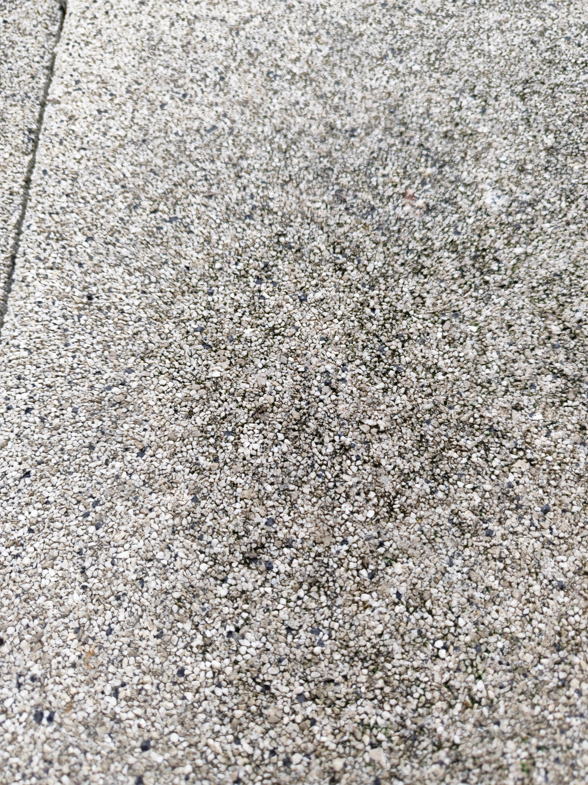
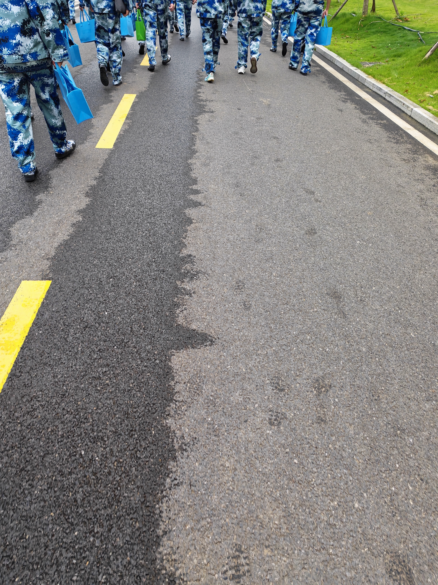

+++
date = 2026-09-19T07:54:00+08:00
draft = false
title = '军训中………'
description = '^⎚‸⎚^'
cover = 'cover.jpg'             # 封面图放在本文章目录里，写文件名即可
categories = ['生活']           # 可选，写了会自动生成分类页
# tags = ['标签一', '标签二']        # 可选
+++

