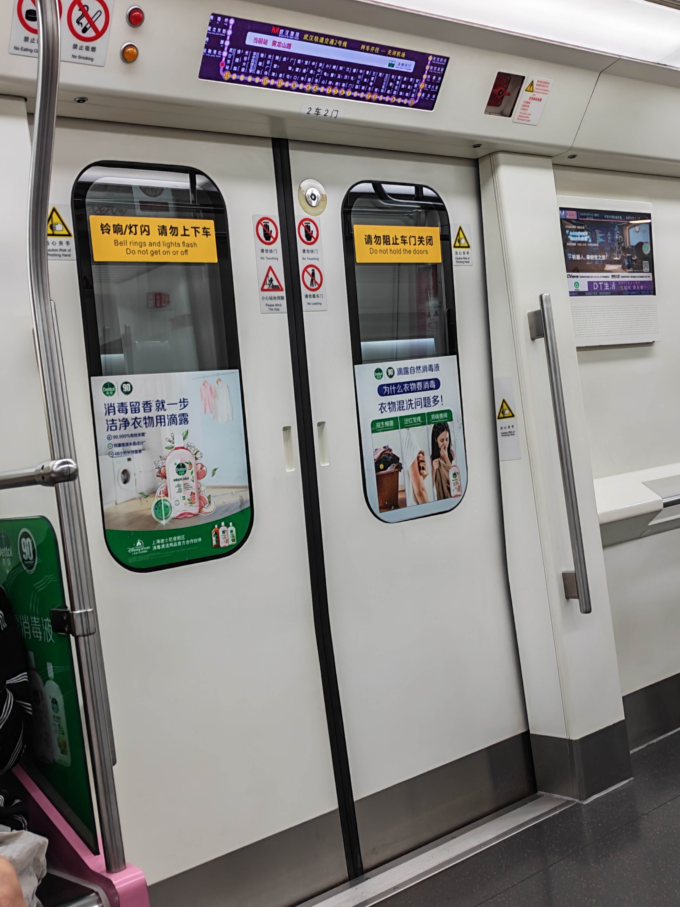
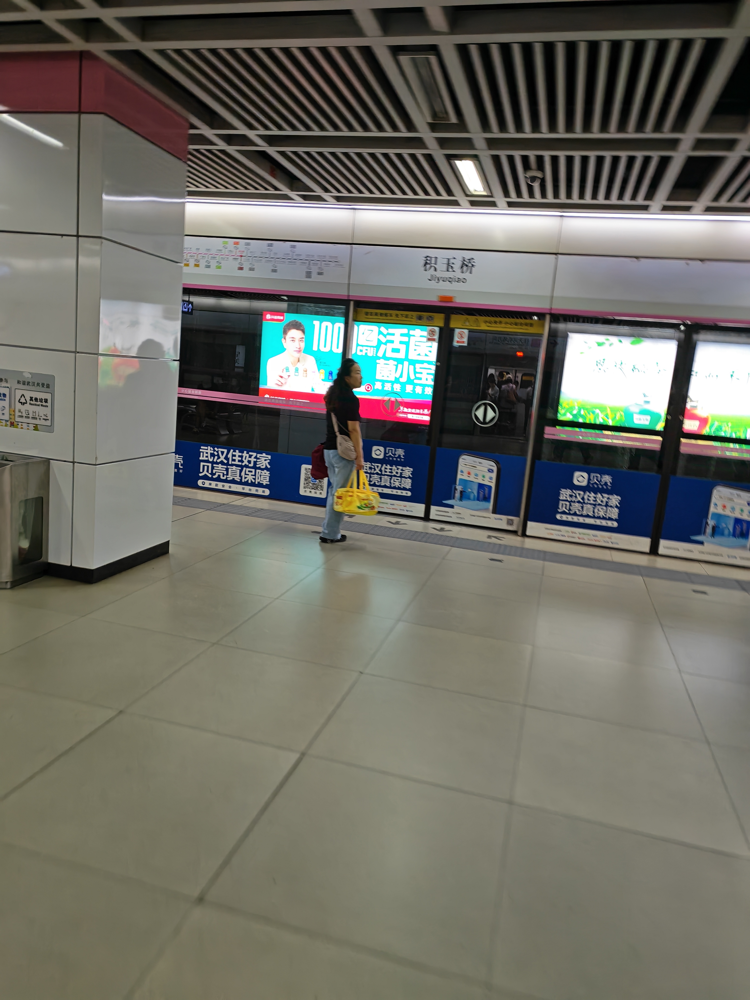
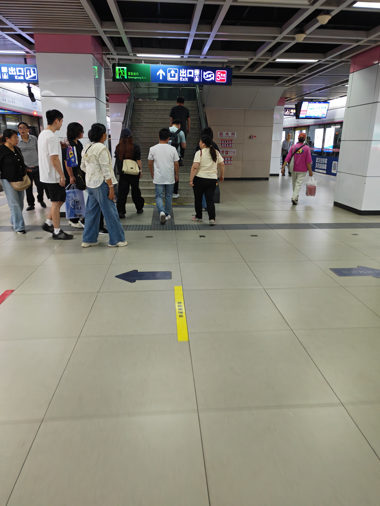
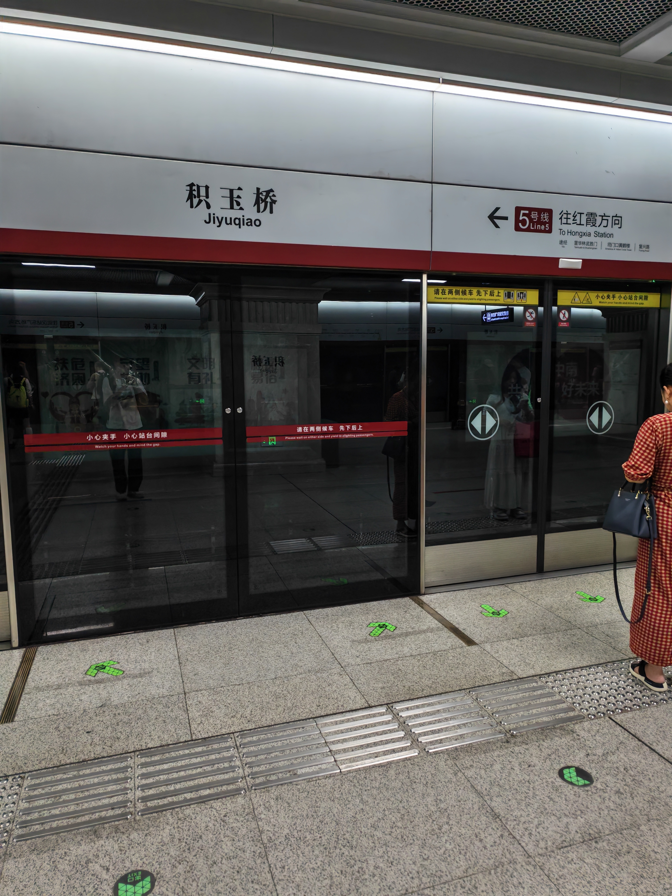
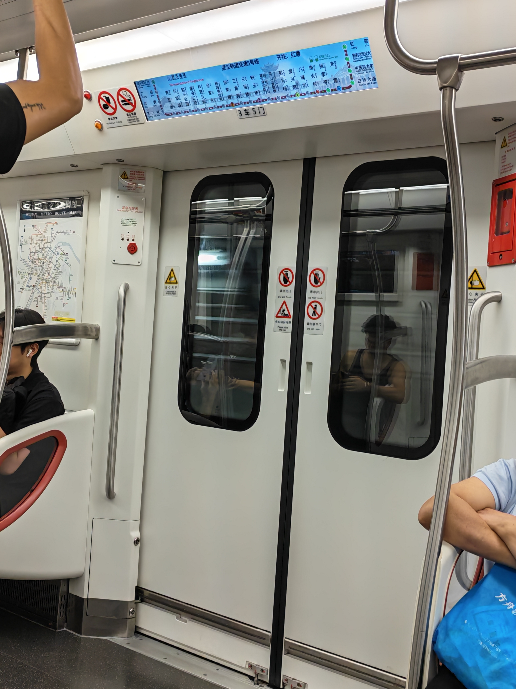
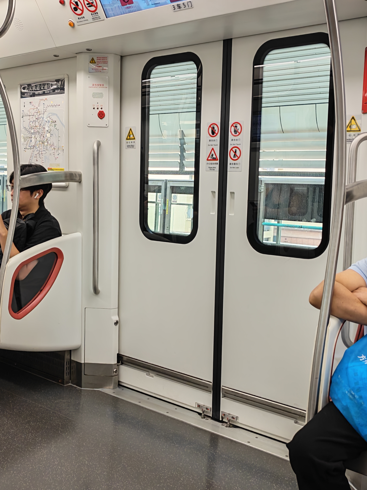
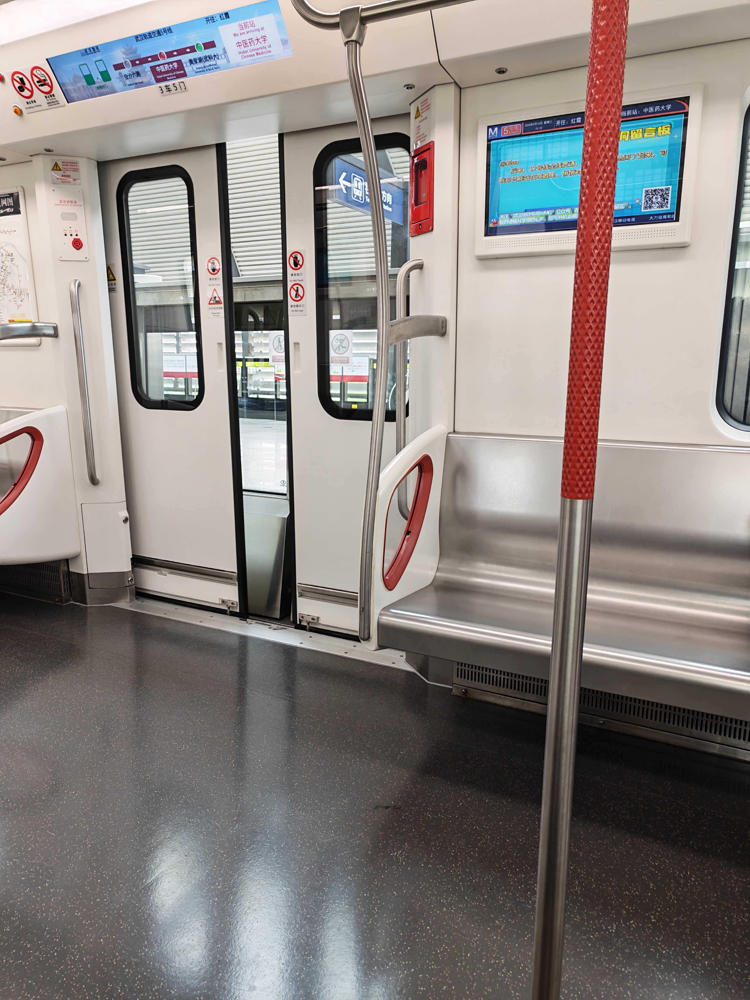
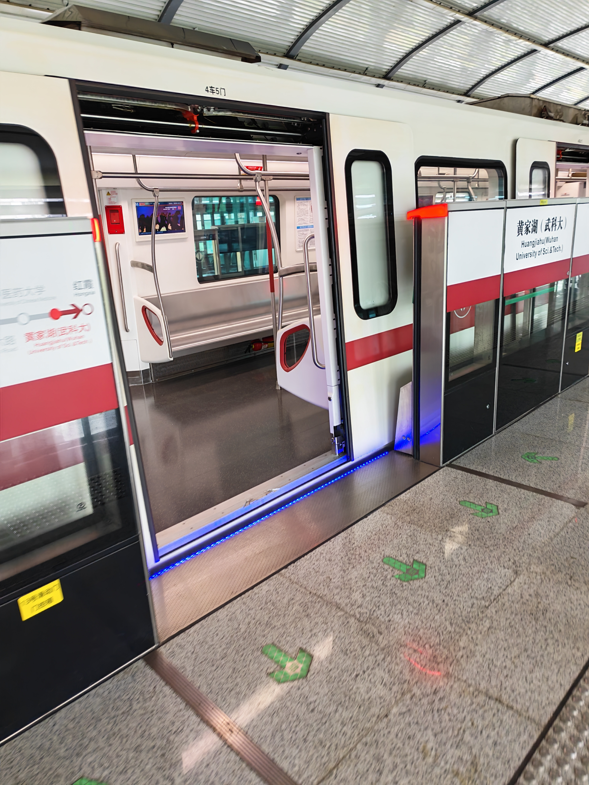
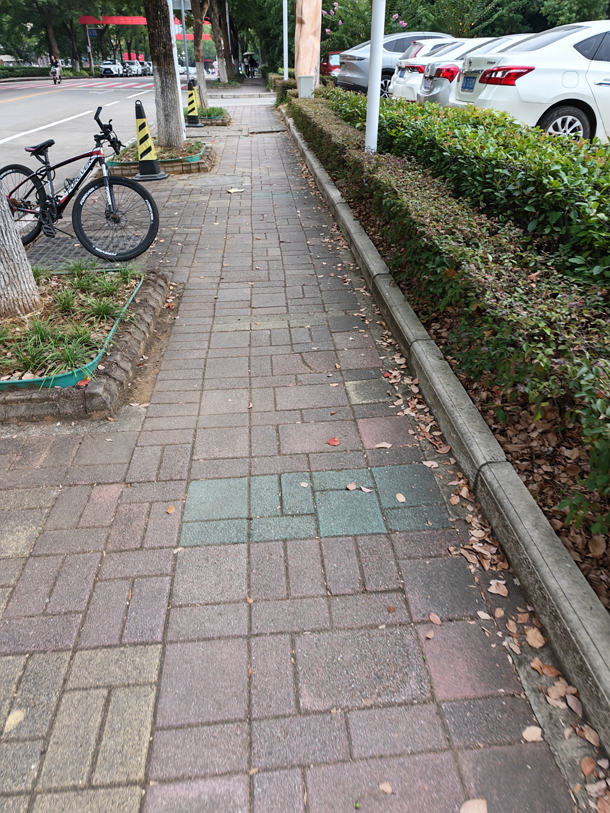

+++
date = 2026-09-16T16:02:16+08:00
draft = false
title = '坐地铁返校'
description = '❍⩊❍'
cover = 'cover.jpg'             # 封面图放在本文章目录里，写文件名即可
categories = ['生活']           # 可选，写了会自动生成分类页
# tags = ['标签一', '标签二']        # 可选
+++

作为一个轨道交通爱好者，学校门口通地铁还是太爽了，而且还是空中的

返校成功🤓