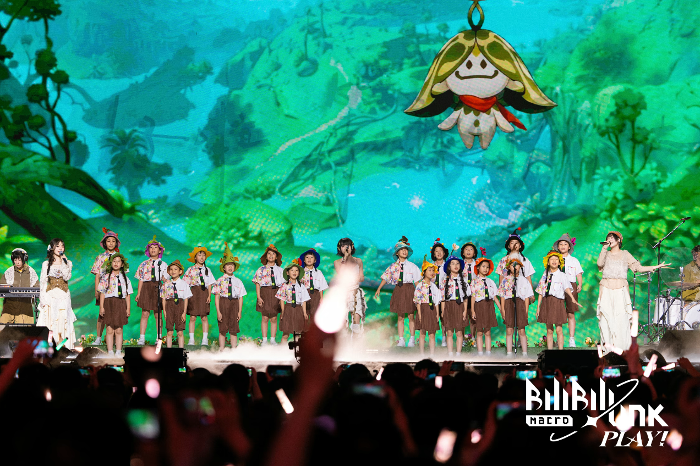
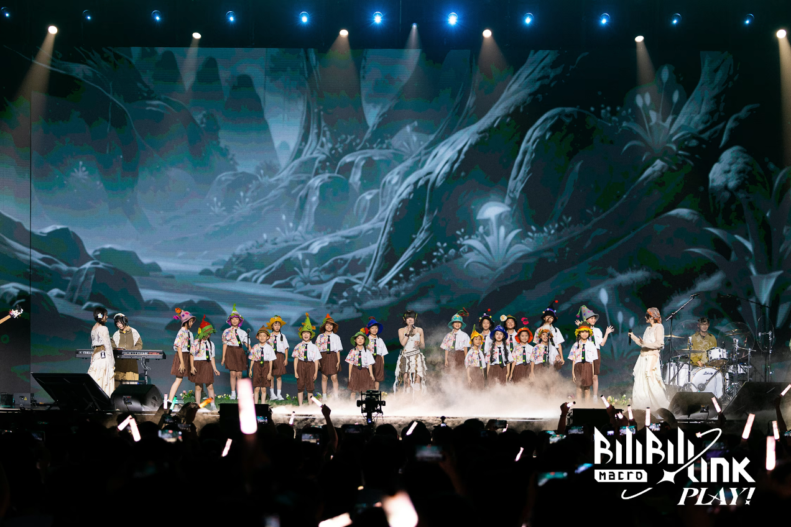

+++
date = 2026-09-14T19:05:54+08:00
draft = false
title = '第一篇！'
description = ''分享一些很喜欢的图片
cover = 'cover.png'            
# categories = ['分类名']           # 可选，写了会自动生成分类页
# tags = ['标签一', '标签二']        # 可选
+++

使用了一整天的时间搭好了这个pages，那第一篇就随便塞点图片吧

